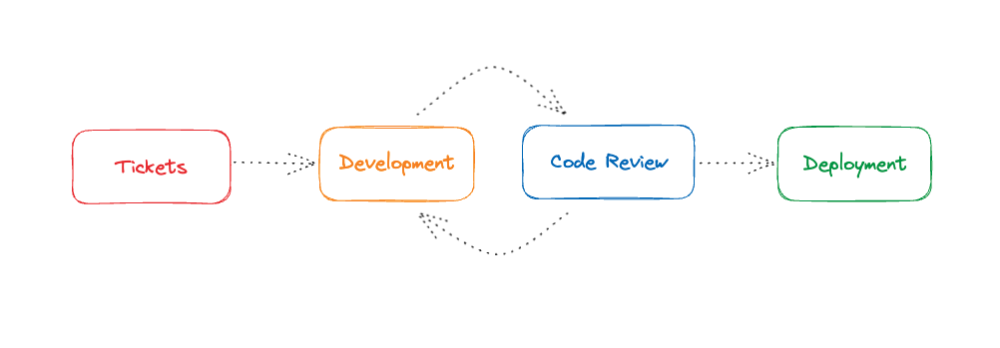
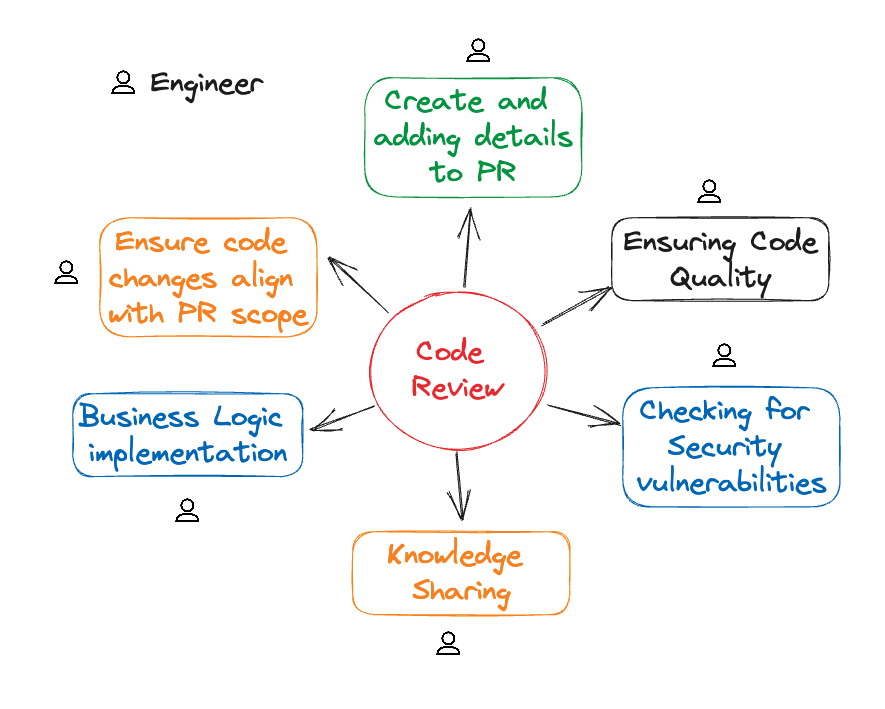
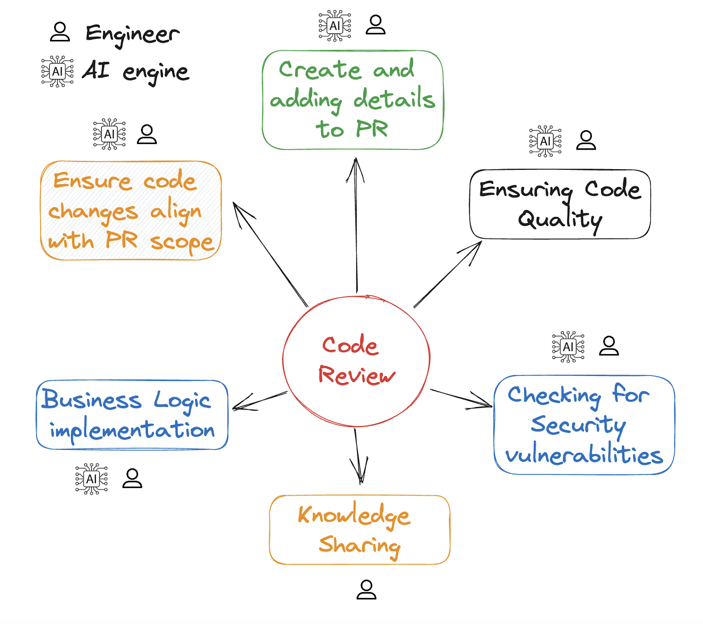

### Introduction

In the era of building and improving products fast, engineering managers
encounter fresh challenges that render traditional strategies outdated. The
amount of time spent trying to make sure that teams not only build products
fast, but also without breaking too much stuff or introducing security
vulnerabilities, is significant.

One of the most time-intensive tasks involves conducting code reviews – these
crucial checkpoints serve as guardians, shielding your codebase from potential
chaos. Additionally, code reviews are an essential part of
[compliance](https://mitratech.com/en_gb/governance-risk-compliance/what-is-enterprise-compliance/);
which is often a requirement when working in an enterprise. Despite their
significance, they can also turn into obstacles, occasionally stalling the
deployment process. The question at hand is: How can we navigate through this
impediment while upholding top-notch code quality?

Introducing AI-powered code reviews! Picture your team's pull requests getting
reviewed as soon as they're made. That's the magic of AI code review tools. For
teams, this means you don't have to wait for hours to get feedback. Reviewers
can still offer more feedback later. It also means your teams can stay on track,
creating and releasing features, without the usual delays of waiting for code
reviews.

We'll discuss the regular stages of software projects and the impact of AI code
reviewers like [CodeRabbit](https://coderabbit.ai) in this digital era. You'll
gain a detailed insight into how these tools are changing the game, making code
reviews faster, smarter, and surprisingly, more human-like.

<!--truncate-->

### The Typical Software Lifecycle Process

Ah, the software lifecycle—the process where we turn ideas into lines of code
that build our products. If you're an engineering manager, you're already
well-versed in the dogma: planning, coding, testing, deploying, and maintaining.
It's a continuous cycle with its own set of challenges.

So, where do code reviews fit into this? They help us make sure that we know
what we are shipping to our users by having different people cross-check each
other's work. You can't skip them; they serve as a critical validation point,
ensuring that the code you're churning out works and is optimized and secure.
Code reviews are the gatekeepers that scrutinize your code before it gets the
VIP pass to merge into the main branch.

But let's be real. Traditionally, this process has been manual, slow (with
delays between opening pull requests and having them reviewed), subjective, and,
yes, prone to human error. But if there's anything the advent of AI code review
tools shows us, there is an opportunity to reclaim some of the time we spend
doing code reviews.

In the upcoming sections, we'll dive deeper into how the traditional and often
cumbersome process of code reviews is changing with AI.

### The Traditional Code Review Method

In the conventional approach, code reviews followed this pattern: one developer
wrote the code and then passed it on to another person for evaluation. The
reviewer took their time to meticulously inspect the code submitted by the
developer. This involved examining lines of code and making notes, comments,
questions, and identifying any problems. This process typically unfolds as
follows:

- A developer creates a Pull Request (PR) and outlines the changes made,
  requesting a review.
- The reviewer, who might be another developer or an engineering manager,
  assesses the code, looking for specific aspects such as:
  - Ensuring that the PR changes align with the scope of the associated
    ticket(s).
  - Confirming the accuracy of business logic implementation.
  - Maintaining or improving code quality by reverting unnecessary changes and
    upholding code quality standards.
  - Verifying that the changes do not introduce security vulnerabilities.
- The reviewer either approves or rejects the PR.
- If approved, the PR can be merged.
- If rejected, the reviewer provides feedback on the required updates for
  approval.

This process has been a fundamental part of modern coding. It relies on the
availability of both the reviewer to provide feedback and the developer to make
changes based on that feedback.

However, manual code reviews can be likened to a risky game with your code's
quality, somewhat resembling playing Russian Roulette. Even with a highly
skilled team, opinions and fatigue can occasionally lead to overlooked mistakes.
Additionally, the pressure of other tasks can make code reviews seem necessary
but frustrating.

Yet, can we truly afford to skip or rush this step? No, not without inviting
bugs and bottlenecks down the road. Thankfully, technological advancements, such
as AI code review tools, show us a better, more efficient way to review code
without having to rely solely on the availability of a human reviewer.

### Challenges of Code Reviews in Teams

Consider this scenario: You've created exceptional code, much like a perfectly
blended smoothie, ready to delight users. However, before you can serve it,
you'd like a team member to evaluate it. This step is crucial because, even when
you put forth your best effort, some issues might go unnoticed. These issues can
later evolve into significant problems, such as critical bugs, system crashes,
or vulnerabilities. Now, imagine that this team member resides in a different
time zone, perhaps asleep or preoccupied with other tasks. It's akin to
attempting to share your smoothie at a party, where everyone struggles to find
the right moment for a sip.

So, what's the solution? You could attempt to enforce a strict schedule for
everyone or request team members to work during unconventional hours. However,
this approach can lead to exhaustion and unhappiness. Instead, why not harness
technology to address this challenge? This is where AI-powered code review tools
come into play. They operate continuously, regardless of time zones, sleep
patterns, or changing moods. They're consistently available to assess your
code's quality without obstructing your project's progress.

The following sections will delve into how these AI platforms streamline code
reviews, making them more manageable and remarkably efficient. Spoiler alert:
Your perception of code quality and team productivity is about to undergo a
transformation.

### Why Manual Reviews Slow You Down: A Look at Productivity Metrics

In code reviews, problems can happen even when everyone works in the same place.
Sometimes, teams just agree without really checking. People might not get along,
causing delays and making things tense. Plus, even if we try really hard, some
issues can slip by us and turn into big, expensive problems like bugs or system
crashes. So, we need better ways to catch these problems early.

Let's look at some numbers because engineering managers really like facts and
figures. Studies tell us that developers spend around 20-30% of their time
[doing code reviews](https://about.gitlab.com/blog/2023/09/03/the-code-review-struggle-is-real-heres-what-you-need-to-know/).
There's even a study
[here](https://smartbear.com/learn/code-review/best-practices-for-peer-code-review/)
that shows our brains struggle to review more than about 400 lines of code at
once, making it harder to spot mistakes.

We all know time is super important. It doesn't just impact how much money the
project makes, but it also affects how much your team gets paid and, in the big
picture, how well the company does overall. When a big chunk of your developers'
time is used up reviewing code, it's not just a tech thing anymore – it's a big
deal for the whole business.

Think about it this way: these hours aren't spent on making cool new stuff,
resolving problems, or coming up with fresh ideas. Instead, they're used up
carefully looking at code that's already there, trying to find mistakes, things
that could work better, and stuff that doesn't fit. This is often where things
slow down and work takes longer. While making sure the code is great is
important, doing it manually uses up resources that could be used better
elsewhere.

This isn't just about shipping faster—although who doesn't want to do that? It's
also about optimizing your team's time so they can focus on what they do best:
create remarkable software. If an AI code review tool can handle the initial
pass, highlighting potential issues with the code, the developer can resolve
initial feedback faster and your human experts can spend their time solving more
complex, higher-level problems.

In the next section, we'll understand how AI-powered code reviewers offer a more
efficient, context-aware, and timely alternative to the traditional approach.
Because let's face it, it's time our methods evolved to match the pace of modern
development cycles of rapid development and iteration.

### AI-Powered Code Reviews: This Changes Everything

 AI, or Artificial Intelligence, might sound like a
trendy word, but in the world of reviewing computer code, it's not just a
passing trend – it's a real game-changer. When we talk about AI in code review
tools, we're not just talking about existing linters or static code analysis
tools. Instead, we're referring to smart feedback that understands the context
of your team's coding rules and the particular project you're working on.

But there's more to it. These AI-powered systems can chat with you, making the
review process feel like a collaboration rather than a machine. This means you
can ask questions, seek clarifications, and even discuss the best approaches,
all in real time. It's like having your most experienced developer, who knows
your code inside and out, ready for reviews 24/7.

Let's clarify a common misunderstanding: AI-based code reviewers are not the
same as code generators. Code generators like
[GitHub Copilot](https://github.com/features/copilot) assist you in writing
code, while AI code reviewers are meant to assess and improve it. They are two
related tools, each with its own unique features and advantages.

In summary, AI-powered code reviews provide faster and reliable feedback without
sacrificing quality or depth. This enhances your team's productivity and allows
you to push the boundaries of what's possible in your development process. You
can learn more by checking this out:
[AI and the Future of Code Reviews: A Deep Dive into CodeRabbit.](../coderabbit-deep-dive-2023-08-26/blog.md)

In the final part, we'll wrap up by explaining why using AI for code reviews
could be a smart strategy you may not have realized you needed. Get ready to
embrace the future, everyone. It's becoming highly efficient. Also, AI code
reviews can assist you in meeting compliance requirements in corporate
environments.

### Conclusion: The Future is Now

Why is now the best time? Well, in simpler terms, before GPT, the automated
tools we had were limited to linting or static code analysis.

As we come to the end of this digital journey, we've seen how software is made,
the challenges of checking code manually, and the exciting potential of using AI
for code reviews. Now, if you're a smart engineering manager looking to keep
your team fast, efficient, and creative, what should you keep in mind?

First, it's pretty clear that code reviews are changing fast. We're no longer
stuck with just people's schedules and opinions. With AI helping out, we're
heading towards a future where code reviews are faster, smarter, more detailed,
and surprisingly, more like how humans do it.

Second, don't underestimate how this change affects your whole process of making
software. Quicker reviews mean you can speed up changes and improvements, making
your team more flexible and ready to jump on opportunities.

Lastly, remember that technology isn't just about using new tools; it's about
using them right to improve things. AI-powered code reviews are super quick,
super accurate, and super thorough, making them a great choice for any team.
Additionally, AI review tools often see problems that people might miss or not
notice.

So, does AI fix all your code review problems? Well, not each one, but it's an
excellent start. The future is here, and it's knocking at your door. Time to let
it in. And with that, we're done with this journey. May your code stay clean,
your reviews be speedy, and your software launches be smooth. Here's to building
a smarter and more efficient future!

### Next Steps: How to save time and improve code quality with AI-Powered Code Reviews

You've come quite a way, and you're probably feeling excited—or at least
intrigued enough to take some action. So, what's the plan? Here's a simple
checklist to help you start your journey with AI-powered code reviews:

1. **Research Options**: Not all AI platforms are the same. Explore their
   features, limits, and costs. Of course, [CodeRabbit](https://coderabbit.ai)
   is a strong option, but go with what suits you.

2. **Talk to Your Team**: Get input from your developers and reviewers. Knowing
   their challenges can guide you in picking the right tool.

3. **Start small**: Begin with a limited scope or team. This helps you
   understand the impact of AI on your process.

4. **Review results**: After the initial phase, check the results. Look at
   factors such as efficiency and quality to gauge its effectiveness.

5. **Expand Gradually**: Happy with the results? Excellent! Now, introduce
   AI-powered code reviews to the whole team and make it a regular practice.

6. **Stay Updated**: AI continues to evolve, and so should your approach. Keep
   up with new features and capabilities to keep improving your review process.

This isn't just a temporary trend; it's a significant shift in how we view code
quality and team efficiency. So take that leap and discover how AI can take your
performance to the next level.

With that, we conclude today's topic. If you have questions or thoughts, feel
free to share them in the comments section. Let's continue the discussion there.
Cheers!
