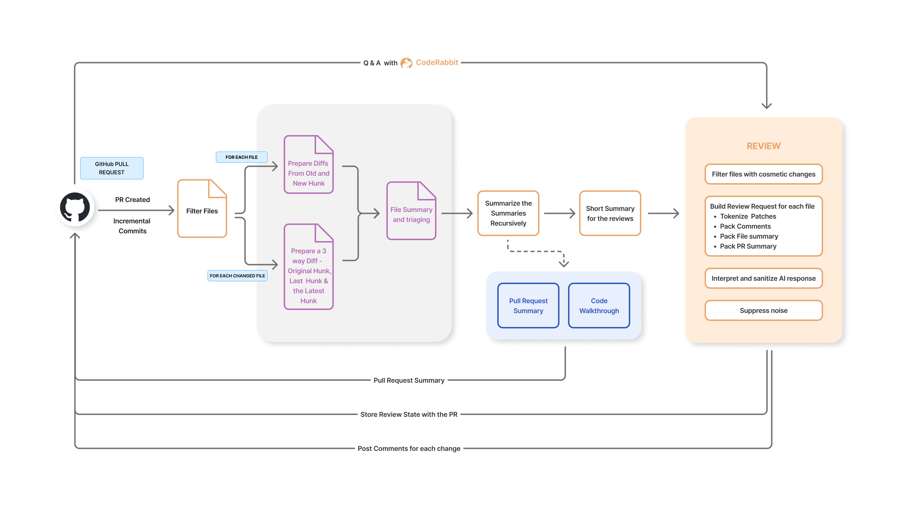
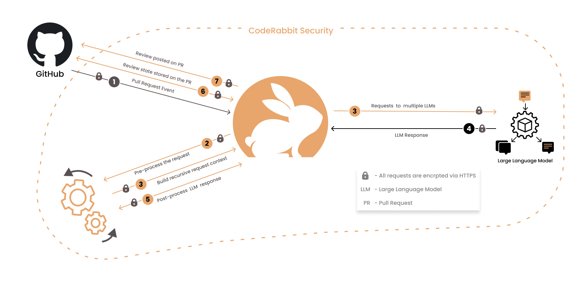

We are witnessing an inflection point in the software development industry.
Developers around the world have been realizing the incredible possibilities
that AI can bring. The introduction of
[GitHub Copilot](https://github.com/features/copilot) and
[ChatGPT](https://chat.openai.com/auth/login) have revolutionized software
development. They have been the
[fastest-growing tools](https://aibusiness.com/companies/one-year-on-github-copilot-adoption-soars)
in the history of software development.

While on the code generation side, many tools have emerged, the code review
process has remained largely unchanged. We continue to use the same tools and
processes that were used 10 years ago. The code is still manually reviewed,
which is slow, error-prone, and expensive. To address this, we are building
[CodeRabbit](https://coderabbit.ai/), an AI-powered code reviewer that is part
of the code merge and CI/CD process. With CodeRabbit our vision is to speed up
the code merge process by an order of magnitude, while also improving the
quality of the code that goes beyond what is possible with human reviewers alone
and existing linting tools.

<!--truncate-->

## Impediments to shipping quality software @Speed

An average developer spends most of their time between writing and reviewing the
code. Typically, the development process involves branching off from the main
code base, developing a new feature or fixing a bug, and then merging the code
back into the mainline. To write software, developers use modern editors such as
Visual Studio Code which include sophisticated language servers, static
analyzers and linters. These tools are being rapidly augmented by AI-powered
extensions such as GitHub Copilot. Local development tools are just one part of
the equation.

Relying on local tools alone is not sufficient to prevent quality issues, as
they are inconsistent across the developers, which makes it difficult to enforce
standards. To ensure quality, the code is merged collaboratively in the form of
[pull requests (PR)](https://docs.github.com/en/pull-requests) in platforms such
as GitHub/GitLab. As soon as the PR is opened, the CI/CD process kicks in. The
code is linted, compiled and tested. Most importantly, the code is reviewed by a
peer who checks for the intention of changes, in addition to looking for coding
standards, security vulnerabilities, and other issues. The reviews require a
broader context to not just understand the changes but also evaluate the impact
on the larger codebase. The reviewer approves the PR, and the code is merged
into the main codebase. The code review is required not just for the quality of
the code but also for meeting compliance and regulatory requirements.

While the ideal code review process sounds smooth and efficient, the reality is
often riddled with challenges and inefficiencies. Specifically, the manual
review is often the slowest part of the development process. It is not uncommon
for a **PR** to take days or even weeks to get merged. Here's a brief glimpse
into the challenges:

**Team Slowdown:** The waiting period for code reviews and merges affects not
just individual developers but the whole team. Project timelines get stretched,
leading to delays in launching new features or fixing critical bugs.

**Context Switching:** Developers often lose context when they switch from
coding to waiting for a review. Getting back into the code takes time and mental
energy, which hampers productivity.

**Rubber-Stamp Reviews:** In dysfunctional teams, the code review process can
become a mere formality. Reviewers might approve code without thorough
inspection, allowing bugs and vulnerabilities to slip through.

**Personality Clashes:** Sometimes, friction between the developer and the
reviewer goes beyond code quality, leading to nitpicking and unnecessary delays.
This can create a toxic work environment, affecting the team's morale.

**Job Dissatisfaction:** Continual delays and inefficiencies in the code merge
process can often demoralize developers to the point where they consider
switching jobs, affecting the company's retention rates.

In summary, the status-quo is not ideal, and it is evident from the software
bugs, security vulnerabilities, and the service outages that frequently plague
the software industry.

## Merging code 10x faster with CodeRabbit

CodeRabbit is an AI-powered code reviewer that significantly speeds up the code
review process while also improving the quality of the code. It works seamlessly
within the pull request workflow and collaborates with the developer and the
reviewer to ensure code quality. It goes beyond existing linters and static code
analysis tools in uncovering issues and suggesting improvements by providing a
human-like understanding of the objective of the code.

With CodeRabbit, developers get context-aware feedback within minutes, which
enables them to make improvements based on best practices and get their code
ready to be merged faster. CodeRabbit also helps reviewers by providing them
with confidence and speed to approve the code faster. Reviewers can use
CodeRabbit's auto-generated walkthrough and suggestions as a starting point for
their review. Peer reviewer can have a three-way collaboration including the
developer, and CodeRabbit, which can significantly enrich the review experience
while saving them time and effort.

CodeRabbit is built on top of the generative AI to provide the following key
capabilities:

**Summarization:** CodeRabbit summarizes the code changes in the PR and provides
a high-level overview. This helps the reviewer and product team to quickly
understand the changes and the impact on the product.

**Incremental Reviews:** CodeRabbit thoroughly reviews the code after each
commit and provides incremental feedback to the developer. It uncovers issues
and suggests improvements by commenting on the code like a human reviewer.

**Chat about changes:** CodeRabbit provides conversational capability that
allows developers and reviewers to ask questions, generate code, and get
feedback in the context of changes.

## Designing CodeRabbit

The review process is multi-stage and shown in the figure below. CodeRabbit's
workflow is triggered when a developer opens a pull request or commits code to
an existing pull request. This is followed by various summarization and review
stages.

CodeRabbit is not just a simple wrapper that does pass-through to the LLM
models. To circumvent context size limits, CodeRabbit uses an innovative,
multi-LLM and multi-stage approach to scale reviews for larger change sets.
Unlike AI-based code completion tools, code reviews are a much more complex
problem. The reviewer context is much broader than the developer context, as the
reviewer needs to uncover not just obvious issues but also understand the larger
context of the pull request and changes across multiple files. Below is a
glimpse into the challenges we faced and the solutions we came up with:

**Context window size:** The LLM models have limited context windows, for
instance, `gpt-3.5-turbo` has a context window of 4K or 16K tokens and `gpt-4`
has a context window of 8K tokens. This is often insufficient to pack larger
change sets. To circumvent this, we provide various summaries while reviewing
changes to each file and by smartly prioritizing context that is packed in each
request.

**Inputting and outputting structured content:** LLMs are particularly bad at
understanding and generating structured content and mathematical computation. We
had to design new input formats, that are closer to how humans understand
changes, instead of using the standard unified diff format. We also had to
provide few-shot examples to the LLMs to get the desired results.

**Noise:** LLMs are terrible at differentiating between noise and signal. For
instance, if you ask LLMs for 20 suggestions, you will get them, but only a few
of them will be useful. This is particularly true for code reviews. We had to
design a multi-stage review process that reinforces the signal and filters out
the noise.

**Costs:** While advanced models like `gpt-4` are great in performing complex
tasks, they are several orders of magnitude more expensive than models like
`gpt-3.5-turbo`. We had to design a multimodel approach that uses simpler models
for summarizations, while complex models are used for tasks such as reviewing
code. In addition, simpler models act as a triage filter that identifies the
changes that need to be thoroughly reviewed by more complex models.

**Inaccuracies:** LLMs are not perfect and often return inaccurate results, and
they sometimes even ignore instructions and completely fabricate a response.
Rather than keep fighting the LLMs, we wrote layers of sanity checks to fix or
hide the inaccuracies from the user.

**Data privacy:** The biggest concern from our users is whether their code is
being stored and used to train the models. We made sure that all queries to LLMs
are ephemeral, and the data is discarded right away from our service. At the
same time, it's challenging to provide stateful incremental reviews without
storing the data. We had to design a system that stores all state within the
pull request itself and not in our service for maximum privacy.

## Conclusion

Building on top of LLMs is a new space, and we can draw parallels to how early
software such as MS-DOS were built on top of IBM PC and Intel microprocessors.
Even with limited memory,
[killer applications](https://www.pcmag.com/news/the-ibm-pcs-killer-apps-where-are-they-now)
were built. The context size limits of LLMs are similar to the memory limits of
early PCs. Innovation is required to build sophisticated applications on top of
LLMs that give the impression of a much larger context, just like early
[3D games](<https://en.wikipedia.org/wiki/Doom_(1993_video_game)>) used
innovative techniques to run even on modest PCs. It's quite likely that immense
value will be captured by the applications while underlying LLMs and AI
infrastructure such as vector databases will continue to get commoditized. In
addition, the line between the actual model training and the prompting continues
to be blurred. Prompts with few-shot examples and fine-tuning can make a big
difference in the quality of results and is an area that will differentiate
products that build on top of LLMs.

At CodeRabbit, we are at the forefront of this innovation by building an
AI-first developer tools company from the ground up. We are approaching this
problem from first principles, as the techniques being used bear little
resemblance to the existing tools like linters and static code analysis tools.
We are witnessing an inflection point as AI has crossed the practicality
threshold, despite its limitations. Furthermore, we believe that we can keep
innovating around the limitations and bring sophisticated products that push the
boundaries of what is possible with AI. We are excited about our roadmap and
hope to unlock immense value for our customers in the near future.

<!-- <ShareButton platform="twitter" text="Twitter" url='CodeRabbit: Bringing AI to Code Reviews&hashtags=CodeRabbitAI'/>

<ShareButton platform="facebook" url="CodeRabbit: Bringing AI to Code Reviews" text="LinkedIn" /> -->
