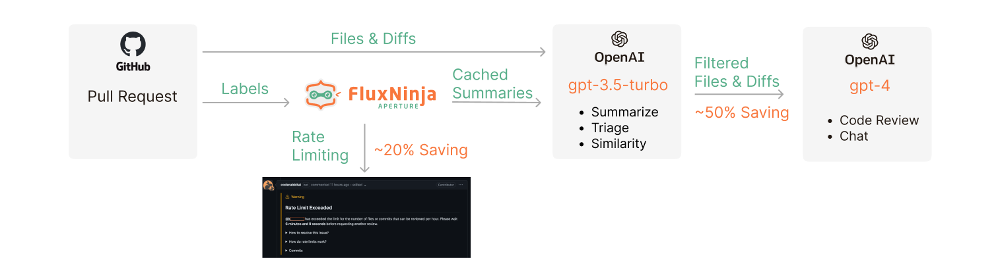
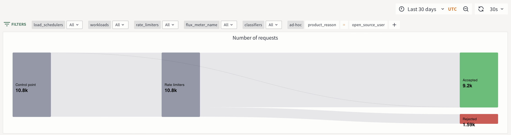

# How we built a cost-effective Generative AI application

Since its inception, CodeRabbit has experienced steady growth in its user base,
comprising developers and organizations. Installed on thousands of repositories,
CodeRabbit reviews several thousand pull requests (PRs) daily. We have
[previously discussed](/blog/coderabbit-openai-rate-limits) our use of an
innovative client-side request prioritization technique to navigate OpenAI rate
limits. In this blog post, we will explore how we manage to deliver continuous,
in-depth code analysis cost-effectively, while also providing a robust, free
plan to open-source projects.

<!--truncate-->

## CodeRabbit's Product Offering and LLM Consumption

CodeRabbit is an AI-first PR Review tool that uses GPT APIs for various
functionalities. CodeRabbit offers the following tiers of service:

- CodeRabbit Pro: A paid service providing in-depth code reviews for private
  repositories. It's priced according to the number of developers, starting with
  a full-featured 14-day free trial.
- CodeRabbit for Open Source: A free service offering in-depth code reviews for
  open source (public) repositories.
- CodeRabbit Free: A free plan for private repositories, providing summarization
  of code changes in a PR.

Our vision is to offer an affordable, AI-driven code review service to
developers and organizations of all sizes while supporting the open-source
community. We are particularly mindful of open-source projects, understanding
the challenges in reviewing community contributions. Our goal is to reduce the
burden of code reviews for open-source maintainers by improving submission
quality before the review process begins.

CodeRabbit's review process is automatically triggered when a PR is opened in
GitHub or GitLab. Each review involves a complex workflow that builds context
and reviews each file using large language models (LLMs). Code review is a
complex task that requires an in-depth understanding of the changes and the
existing codebase. High-quality review comments necessitate state-of-the-art
language models such as gpt-4. However, these models are significantly more
expensive than simpler models, as shown by the
[10x-30x price difference](https://openai.com/pricing) between gpt-3.5-turbo and
gpt-4 models.

| Model         | Context Size | Cost per 1k Input Tokens | Cost per 1k Output Tokens |
| ------------- | ------------ | ------------------------ | ------------------------- |
| GPT-4         | Up to 32k    | $0.06                    | $0.12                     |
| GPT-4         | Up to 8k     | $0.03                    | $0.06                     |
| GPT-3.5 Turbo | Up to 16k    | $0.003                   | $0.004                    |
| GPT-3.5 Turbo | Up to 4k     | $0.0015                  | $0.002                    |

> gpt-4 model is 10-30x more expensive than gpt-3.5-turbo model

Our primary cost driver is using OpenAI's API to generate code review comments.
We will share our cost optimization strategies in the following sections.
Without these optimizations, our free offering to open-source projects would not
be feasible.

Let's take a look at the strategies that helped us optimize the cost and improve
user experience.

---

## 1. Dual-models: Summarize & Triage Using Simpler Models

For less complex tasks such as summarizing code diffs, simpler models such as
gpt-3.5-turbo are adequate. As an initial optimization, we use a mix of models,
as detailed in [our earlier blog post](/blog/coderabbit-deep-dive). We use
gpt-3.5-turbo to compress large code diffs into concise summaries, which are
then processed by gpt-4 for reviewing each file. This dual-model approach
significantly reduces costs and enhances review quality, enabling us to manage
PRs with numerous files and extensive code differences.

Additionally, we implemented triage logic to skip trivial changes from the
review process. We use the simpler model to classify each diff as either trivial
or complex, as part of the same prompt used for code diff summarization.
Low-risk changes such as documentation updates, variable renames, and so on, are
thus excluded from the thorough review process. This strategy has proven
effective, as simpler models can accurately identify trivial changes.

By using this dual-model approach for summarization and filtering out trivial
changes, we save almost 50% on costs.

## 2. Rate-limiting: Enforcing Fair Usage

Upon launching our free service for open-source projects, we noticed individual
developers using it as a coding co-pilot by making hundreds of incremental
commits for continuous feedback. CodeRabbit, designed for thorough code reviews
unlike tools such as GitHub Copilot, incurs high costs when used in this manner.
Therefore, we implemented hourly rate-limits on the number of files and commits
reviewed per user, to control excessive usage without compromising user
experience. These limits vary across different product tiers. For example, we
set more aggressive limits for open-source users compared to trial and paid
users.

To implement these rate-limits, we evaluated various options for Serverless
environments. We opted for [FluxNinja Aperture](https://fluxninja.com/) for its
simplicity and policy sophistication. We were already using Aperture for
managing [OpenAI rate limits](coderabbit-openai-rate-limits), making it a
natural choice for our rate-limiting needs as well.

In FluxNinja Aperture, policies are decoupled from application logic through
labels, enabling new policy additions without altering application code. We
apply labels in FluxNinja Aperture, wrap the review workload with its SDK, and
write policies that enforce limits on those labels. For example, we enforce a 3
reviews per hour limit (1 review every 20 minutes) for open-source users,
allowing a burst of 2 back-to-back reviews, as shown in the screenshots below.

Integration with FluxNinja Aperture SDK

_Rate-limiting commits per hour for open-source users_

_Wait time feedback to the user in a comment_

Given the high cost and capacity constraints of state-of-the-art models such as
gpt-4, rate-limiting is an essential requirement for any AI application. By
implementing fair-usage rate limits, we are saving almost 20% on our costs.

_Rate limit metrics for open-source users_

## 3. Caching: Avoid Re-generating Similar Review Comments

We believe that building user habits around AI involves seamlessly augmenting
existing workflows. Therefore, AI code reviews must be continuous: they should
trigger as soon as a PR is opened and incrementally update the summary and
generate review comments as more commits are added.

However, this approach can become expensive and generate repetitive feedback, as
similar review comments are re-generated for each commit. We observed that most
incremental commits involve minor adjustments or bug fixes in the initial
implementation. To address this, we implemented a caching layer to avoid
re-generating similar review comments for incremental commits.

Fortunately, Aperture also provides a simple caching mechanism for summaries
from previous commits, using the same API call where we implemented rate limits.
During each incremental review, we use the simpler model for a semantic
comparison of the code changes described in both summaries. If the changes are
similar, we skip the review for those files to prevent re-generating similar
review comments. This method differs from vector similarity-based caching
techniques, as we use an LLM model for comparing summaries. Vector
similarity-based approaches wouldn't be effective in our case, as the summaries
require semantic comparison. We have integrated this method into the same prompt
used for code diff summarization and triage.

By using the more cost-effective gpt-3.5-turbo model as an advanced similarity
filter before invoking the more expensive gpt-4 model for the same file, we have
saved almost 20% of our costs by avoiding the generation of similar review
comments.

---

## Conclusion

In this blog post, we briefly discussed how state-of-the-art LLMs such as gpt-4
can be expensive in production. We also shared our strategy of using a
combination of simpler models, rate limits, and caching to optimize operational
costs. We hope our experiences can assist other AI startups in optimizing their
costs and developing cost-effective AI applications.
