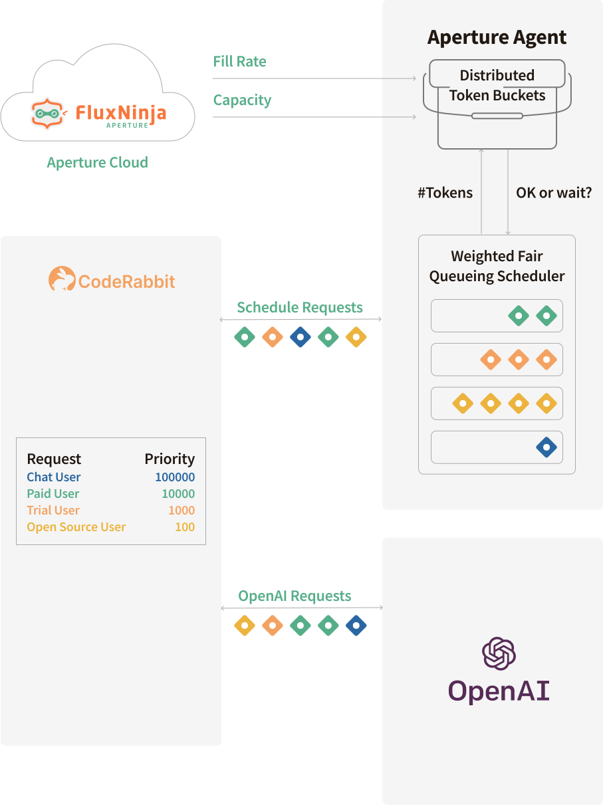

```mdx-code-block
import Tabs from '@theme/Tabs';
import TabItem from '@theme/TabItem';
```

Since CodeRabbit launched a couple of months ago, it has received an
enthusiastic response and hundreds of sign-ups. CodeRabbit has been installed in
over 1300 GitHub organizations and typically reviews more than 2000 pull
requests per day. Furthermore, the usage continues to flourish; we are
experiencing a healthy week-over-week growth.

While this rapid growth is encouraging, we've encountered challenges with
OpenAI's stringent rate limits, particularly for the newer `gpt-4` model that
powers CodeRabbit. In this blog post, we will delve into the details of OpenAI
rate limits and explain how we leveraged the
[FluxNinja's Aperture](https://www.fluxninja.com/) load management platform to
ensure a reliable experience as we continue to grow our user base.

<!--truncate-->

## Understanding OpenAI rate limits

OpenAI imposes
[fine-grained rate limits](https://platform.openai.com/docs/guides/rate-limits/overview)
on both requests per minute and tokens per minute for each AI model they offer.
In our account, for example, we are allocated the following rate limits:

| Model             | Tokens per minute | Requests per minute |
| ----------------- | ----------------- | ------------------- |
| gpt-3.5-turbo     | 1000000           | 12000               |
| gpt-3.5-turbo-16k | 180000            | 3500                |
| gpt-4             | 40000             | 200                 |

We believe that the rate limits are in place for several reasons and are
unlikely to change in the near future:

- Advanced models such as `gpt-4` are computationally intensive. Each request
  can take several seconds or even minutes to process. For example, 30s response
  time is fairly typical for complex tasks. OpenAI sets these limits to manage
  aggregate load on their infrastructure and provide fair access to users.
- The demand for AI has outstripped the supply of available hardware,
  particularly the GPUs required to run these models. It will take some time for
  the industry to meet this exploding demand.

## CodeRabbit's OpenAI usage pattern and challenges

CodeRabbit is an AI-driven code review application that integrates with GitHub
or GitLab repositories. It analyzes pull requests and provides feedback to the
developers on the quality of their code. The feedback is provided in the form of
comments on the pull request, allowing the developers to enhance the code based
on the provided suggestions in the follow-up commits.


CodeRabbit employs a combination of the `gpt-3.5-turbo` and `gpt-4` family of
models. For simpler tasks such as summarization, we use the more economical
`gpt-3.5-turbo` model, whereas intricate tasks such as in-depth code reviews are
performed by the slow and expensive `gpt-4` model.

Our usage pattern is such that each file in a
[pull request is summarized and reviewed concurrently](https://coderabbit.ai/blog/coderabbit-deep-dive).
During peak hours or when dealing with large pull requests (consisting of 50+
files), we began to encounter `429 Too Many Requests` errors from OpenAI. Even
though, we had a retry and back-off mechanism, many requests were still timing
out after multiple attempts. Our repeated requests to OpenAI to increase our
rate limits were met with no success.

To mitigate these challenges, we cobbled together a makeshift solution for our
API client:

- We set up four separate OpenAI accounts to distribute the load.
- Implemented an API concurrency limit on each reviewer instance to cap the
  number of in-flight requests to OpenAI.
- Increased the back-off time for each retry and increased the number of
  retries. OpenAI's rate limit headers were not helpful in determining the
  optimal back-off times, as the
  [headers](https://platform.openai.com/docs/guides/rate-limits/rate-limits-in-headers)
  were outdated by tens of seconds and do not consider the in-flight requests.
- Transitioned from function-based serverless framework to a containerized
  environment to benefit from extended timeout capabilities to ensure that
  instances would not be terminated while requests were in the retry-back-off
  loop.

Although these adjustments provided temporary relief, the challenges resurfaced
as the load increased within a few days. We were doing much guesswork to figure
out the "right" number of concurrent requests, back-off times, max retries and
so on.

Complicating matters further, we added a chat feature that allows users to
consult the CodeRabbit bot for code generation and technical advice. While we
aimed for real-time responses, the back-off mechanisms made reply time
unpredictable, particularly during peak usage, thereby degrading the user
experience.

We needed a better solution, one that could globally manage the rate limits
across all reviewer instances and prioritize requests based on user tiers and
the nature of requests.

## FluxNinja Aperture to the rescue

We were introduced to the [FluxNinja Aperture](https://www.fluxninja.com/) load
management platform by one of our advisors.
[Aperture](https://github.com/fluxninja/aperture) is an open-source load
management platform that offers advanced rate-limiting, request prioritization,
and quota management features. Essentially, Aperture serves as a global token
bucket, facilitating client-side rate limits and business-attribute-based
request prioritization.

### Implementing the Aperture TypeScript SDK in our reviewer service

Our reviewer service runs on Google Cloud Run, while the Aperture Agents are
deployed on a separate Kubernetes cluster (GKE). To integrate with the Aperture
Agents, we employ Aperture's TypeScript SDK. Before calling OpenAI, we rely on
Aperture Agent to gate the request using the `StartFlow` method. To provide more
context to Aperture, we also attach the following labels to each request:

- `model_variant`: This specifies the model variant being used (`gpt-4`,
  `gpt-3.5-turbo`, or `gpt-3.5-turbo-16k`). Requests and tokens per minute rate
  limit policies are set individually for each model variant.
- `api_key` - This is a cryptographic hash of the OpenAI API key, and rate
  limits are enforced on a per-key basis.
- `estimated_tokens`: As the tokens per minute quota limit is enforced based on
  the
  [estimated tokens for the completion request](https://platform.openai.com/docs/guides/rate-limits/reduce-the-max_tokens-to-match-the-size-of-your-completions),
  we need to provide this number for each request to Aperture for metering.
  Following OpenAI's
  [guidance](https://help.openai.com/en/articles/4936856-what-are-tokens-and-how-to-count-them),
  we calculate `estimated_tokens` as `(character_count / 4) + max_tokens`. Note
  that OpenAI's rate limiter doesn't tokenize the request using the model's
  specific tokenizer but relies on a character count-based heuristic.
- `product_tier`: CodeRabbit offers both `pro` and `free` tiers. The `pro` tier
  provides comprehensive code reviews, whereas the `free` tier offers only the
  summary of the pull request.
- `product_reason`: We also label why a review was initiated under the `pro`
  tier. For example, the reasoning could that the user is a `paid_user`,
  `trial_user` or a `open_source_user`. Requests to OpenAI are prioritized based
  on these labels.
- `priority`: Requests are ranked according to a priority number provided in
  this label. For instance, requests from `paid_user` are given precedence over
  those from `trial_user` and `open_source_user`. The base priority is
  incremented for each file reviewed, enabling pull requests that are further
  along in the review process to complete more quickly than newly submitted
  ones. Additionally, chat messages are assigned a much higher priority compared
  to review tasks.



<details>
<summary>Integration with Aperture TypeScript SDK</summary>
<p>

```typescript
  let flow: Flow | undefined = undefined

     if (this.apertureClient) {
      const charCount =
       this.systemMessage.length +
       message.length +
       String("system" + "user").length
      const labels: Record<string, string> = {
       api_key: CryptoES.SHA256(api.apiKey).toString(),
       estimated_tokens: (
        Math.ceil(charCount / 4) + responseTokens
       ).toString(),
       model_variant: modelVariant,
       product_tier: this.settings.product_tier,
       product_reason: this.settings.product_reason,
       priority: String(
        PRIORITIES[this.settings.product_reason] + priorityBump,
       ),
       prompt_type: promptType,
      }

      flow = await this.apertureClient.StartFlow("openai", {
       labels: labels,
       grpcCallOptions: {
        deadline: Date.now() + 1200000,
       },
      })
     }

     // As we use Aperture as a queue, send the message regardless of whether it was accepted or rejected
     try {
      const { data: chatCompletion, response: raw } = await api.chat.completions
       .create({
        model: modelVariant,
        temperature: temperature,
        top_p: topP,
        max_tokens: responseTokens,
        messages: messages,
       })
       .withResponse()
       .catch(err => {
        logger.error(`openai chat error: ${JSON.stringify(err)}`)
        throw err
       })
      )
      return chatCompletion.choices[0]?.message?.content ?? ""
     } catch (e) {
      flow?.SetStatus(FlowStatusEnum.Error)
      throw e // throw the error to be caught by the chat function
     } finally {
      flow?.End()
     }

```

</p>
</details>

### Policy configuration in Aperture: Aligning with OpenAI's rate limits

Aperture offers a foundational "blueprint" for
[managing quotas](https://docs.fluxninja.com/reference/blueprints/quota-scheduling/base),
comprising two main components:

- Rate limiter: OpenAI employs a token bucket algorithm to impose rate limits,
  and that is directly compatible with Aperture's rate limiter. For example, in
  the tokens per minute policy for `gpt-4`, we have allocated a burst capacity
  of `40000 tokens`, and a refill rate of `40000 tokens per minute`. The bucket
  begins to refill the moment the tokens are withdrawn, aligning with OpenAI's
  rate-limiting mechanism. This ensures our outbound request and token rate
  remains synchronized with OpenAI's enforced limits.
- Scheduler: Aperture has a
  [weighted fair queuing](https://docs.fluxninja.com/concepts/scheduler/)
  scheduler that prioritizes the requests based on multiple factors such as the
  number of tokens, priority levels and workload labels.

By fine-tuning these two components in Aperture, we can go as fast as we can,
with optimal user experience, while ensuring that we don't exceed the rate
limits.

<details>
<summary>Client-side quota management policies for gpt-4</summary>
<p>

```mdx-code-block
<Tabs>
<TabItem value="Tokens Per Minute (gpt-4)">
```

```yaml
# yaml-language-server: $schema=https://raw.githubusercontent.com/fluxninja/aperture/latest/blueprints/quota-scheduling/base/gen/definitions.json
# Generated values file for quota-scheduling/base blueprint
# Documentation/Reference for objects and parameters can be found at:
# https://docs.fluxninja.com/reference/blueprints/quota-scheduling/base

blueprint: quota-scheduling/base
uri: github.com/fluxninja/aperture/blueprints@latest
policy:
  # Name of the policy.
  # Type: string
  # Required: True
  policy_name: gpt-4-tpm
  quota_scheduler:
    # Bucket capacity.
    # Type: float64
    # Required: True
    bucket_capacity: 40000
    # Fill amount.
    # Type: float64
    # Required: True
    fill_amount: 40000
    # Rate Limiter Parameters
    # Type: aperture.spec.v1.RateLimiterParameters
    # Required: True
    rate_limiter:
      interval: 60s
      label_key: api_key
    scheduler:
      priority_label_key: priority
      tokens_label_key: estimated_tokens
    # Flow selectors to match requests against
    # Type: []aperture.spec.v1.Selector
    # Required: True
    selectors:
      - control_point: openai
        agent_group: coderabbit-prod
        label_matcher:
          match_labels:
            model_variant: gpt-4
```

```mdx-code-block
</TabItem>
<TabItem value="Requests Per Minute (gpt-4)">
```

```yaml
# yaml-language-server: $schema=https://raw.githubusercontent.com/fluxninja/aperture/latest/blueprints/quota-scheduling/base/gen/definitions.json
# Generated values file for quota-scheduling/base blueprint
# Documentation/Reference for objects and parameters can be found at:
# https://docs.fluxninja.com/reference/blueprints/quota-scheduling/base

blueprint: quota-scheduling/base
uri: github.com/fluxninja/aperture/blueprints@latest
policy:
  # Name of the policy.
  # Type: string
  # Required: True
  policy_name: gpt-4-rpm
  quota_scheduler:
    # Bucket capacity.
    # Type: float64
    # Required: True
    bucket_capacity: 200
    # Fill amount.
    # Type: float64
    # Required: True
    fill_amount: 200
    # Rate Limiter Parameters.
    # Type: aperture.spec.v1.RateLimiterParameters
    # Required: True
    rate_limiter:
      interval: 60s
      label_key: api_key
    scheduler:
      priority_label_key: priority
    # Flow selectors to match requests against
    # Type: []aperture.spec.v1.Selector
    # Required: True
    selectors:
      - control_point: openai
        agent_group: coderabbit-prod
        label_matcher:
          match_labels:
            model_variant: gpt-4
```

```mdx-code-block
</TabItem>
</Tabs>
```

</p>
</details>

## Reaping the benefits

During peak hours, we typically process tens of pull requests, hundreds of
files, and chat messages concurrently. The image below shows the incoming token
rate and the accepted token rate for the `gpt-4` tokens-per-minute policy. We
can observe that the incoming token rate is spiky, while the accepted token rate
remains smooth and hovers around `666 tokens per second`. This roughly
translates to `40,000 tokens per minute`. Essentially, Aperture is smoothing out
the fluctuating incoming token rate to align it with OpenAI's rate limits.


The below image shows request prioritization metrics from the Aperture Cloud
console during the same peak load period:


In the upper left panel of the metrics, noticeable peaks indicate that some
requests got queued for several minutes in Aperture. We can verify that the
trial and free-tier users tend to experience longer queue times compared to
their paid counterparts and chat requests.

Queue wait times can fluctuate based on the volume of simultaneous requests in
each workload. For example, wait times are significantly longer during peak
hours as compared to off-peak hours. Aperture provides scheduler preemption
metrics to offer further insight into the efficacy of prioritization. As
observed in the lower panels, these metrics measure the relative impact of
prioritization for each workload by comparing how many tokens a request gets
preempted or delayed in the queue compared to a purely First-In, First-Out
(FIFO) ordering.

In addition to effectively managing the OpenAI quotas, Aperture provides
insights into OpenAI API performance and errors. The graphs below show the
overall response times for various OpenAI models we use. We observe that the
`gpt-4` family of models is significantly slower compared to the `gpt-3.5-turbo`
family of models. This is quite insightful, as it hints at why OpenAI's
infrastructure struggles to meet demand - these APIs are not just simple
database or analytics queries; they are computationally expensive to run.


## Conclusion

Aperture has been a game-changer for CodeRabbit. It has enabled us to continue
signing up users and growing our usage without worrying about OpenAI rate
limits. Without Aperture, our business would have hit a wall and resorted to a
wait-list approach, which would have undermined our traction. Moreover, Aperture
has provided us with valuable insights into OpenAI API performance and errors,
helping us monitor and improve the overall user experience.

In the realm of generative AI, we are dealing with a fundamentally different
nature of API dynamics. Performance wise, these APIs are an order of magnitude
slower than traditional APIs. We believe that request scheduling and
prioritization will become a critical component of the AI infrastructure stack,
and with Aperture, FluxNinja is well positioned to be the leader in this space.
As CodeRabbit continues to build and add additional components such as vector
databases, which are also computationally expensive, we are confident that
Aperture will continue to help us offer a reliable experience to our users.
