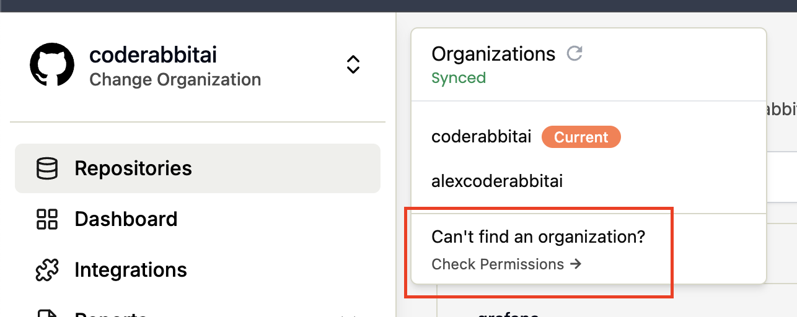

To add new organizations to CodeRabbit, follow these steps:

1. Navigate to [coderabbit.ai](https://coderabbit.ai)
2. Click the "Refresh" button next to your organizations list to check for new organizations
3. Find the organization you want to add in the list
4. Click the "Grant" button next to the organization name

This will grant CodeRabbit access to the selected organization, allowing it to:

- Read organization and team membership
- Read organization projects
- Access user email addresses (read-only)

> Note: Organizations control which applications are allowed to access their private data. You may need organization admin approval to complete this process.
