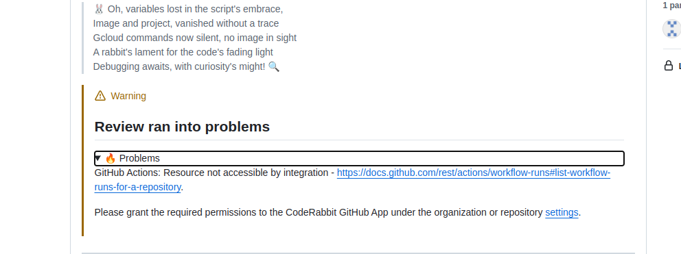
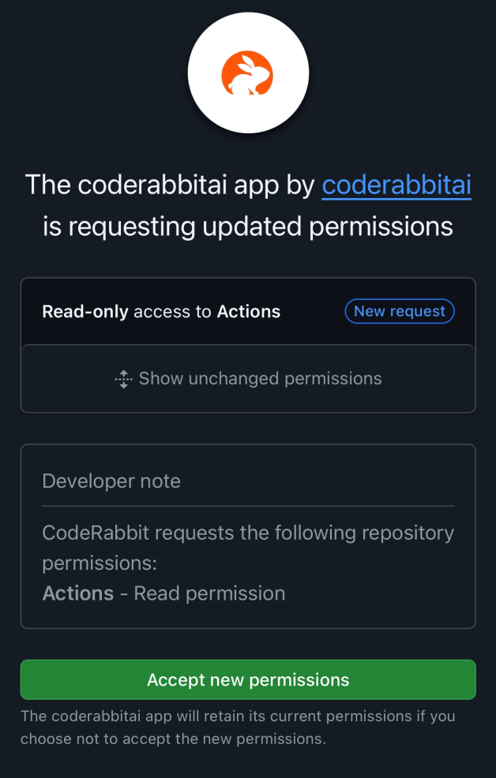

Sometimes when we add new features to CodeRabbit, we need to request additional GitHub permissions. If you see a warning about permissions or resources not being accessible, you'll need to approve the new permissions. Here's how to do it:

1. Navigate to your organization or repository settings in GitHub
2. Go to the "GitHub Apps" or "Installed GitHub Apps" section
3. Find CodeRabbit in the list of installed apps
4. Click "Configure"
5. Review and accept the new permissions

Common reasons for permission updates include:

- Access to new GitHub features
- Enhanced repository scanning capabilities
- Additional workflow automation features
- Improved security features

> Note: If you're not an organization admin, you may need to request approval from your organization administrators to update the permissions.

After accepting the new permissions, CodeRabbit will have the access it needs to function properly. If you continue to experience issues, try refreshing your browser or reaching out to our support team.
