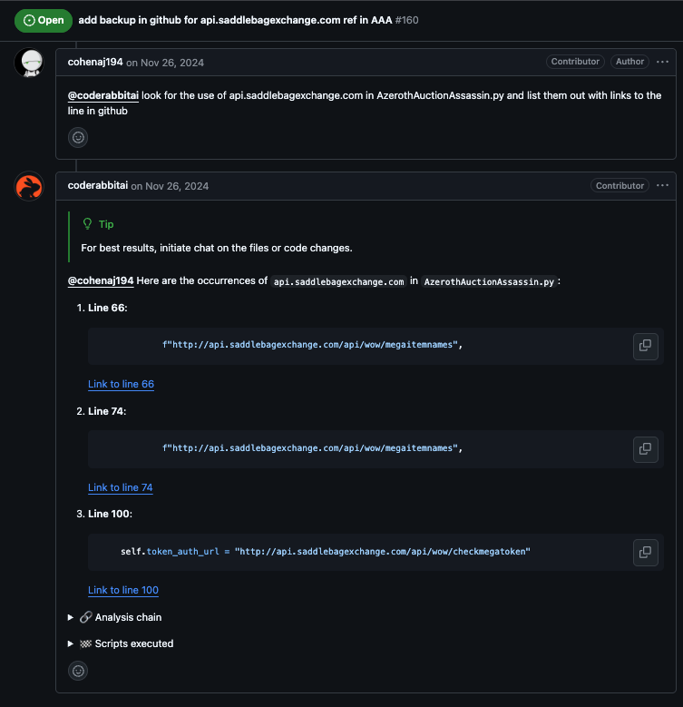
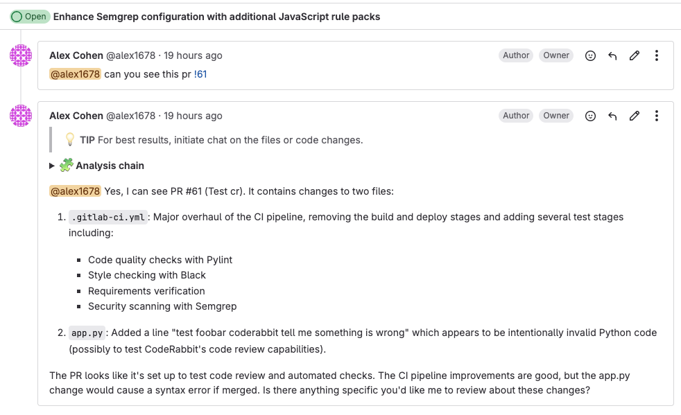
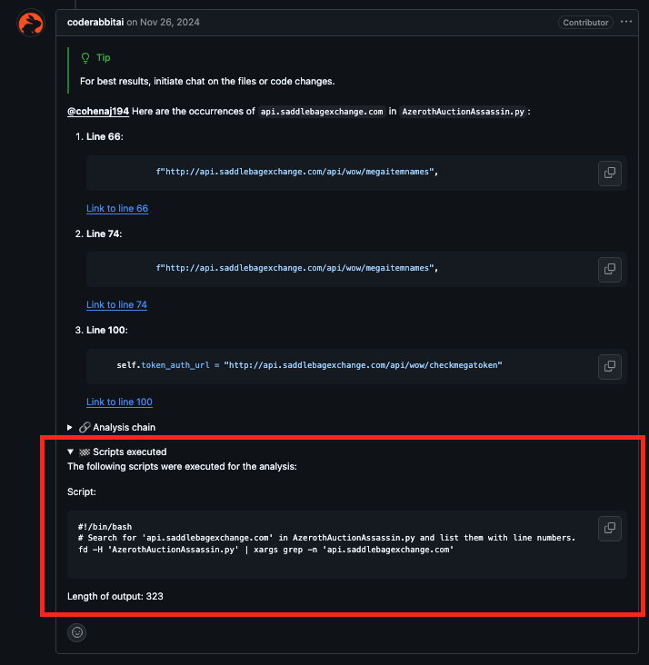
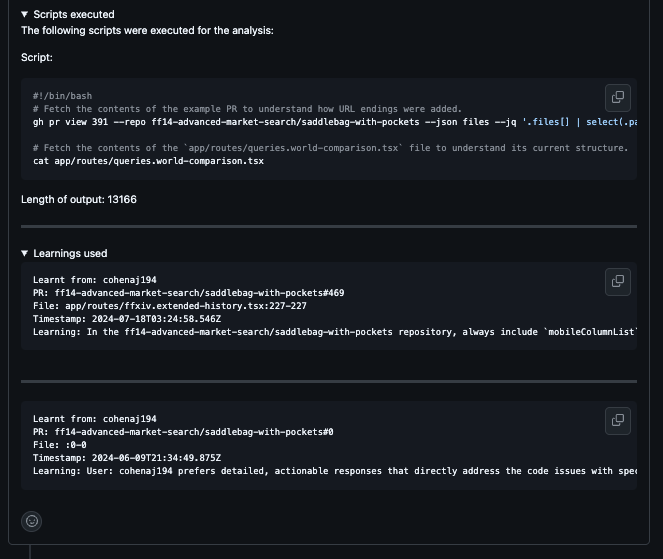
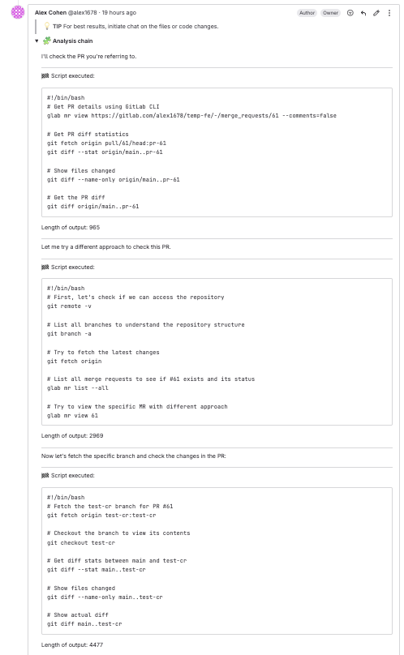
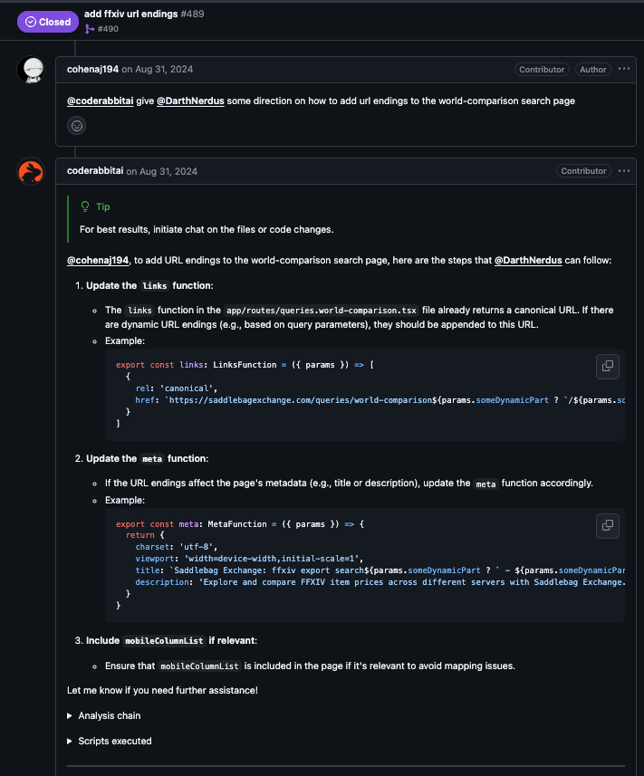
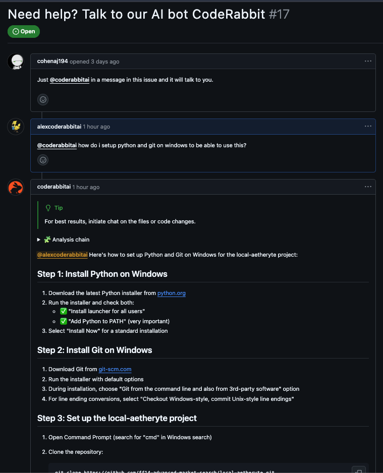
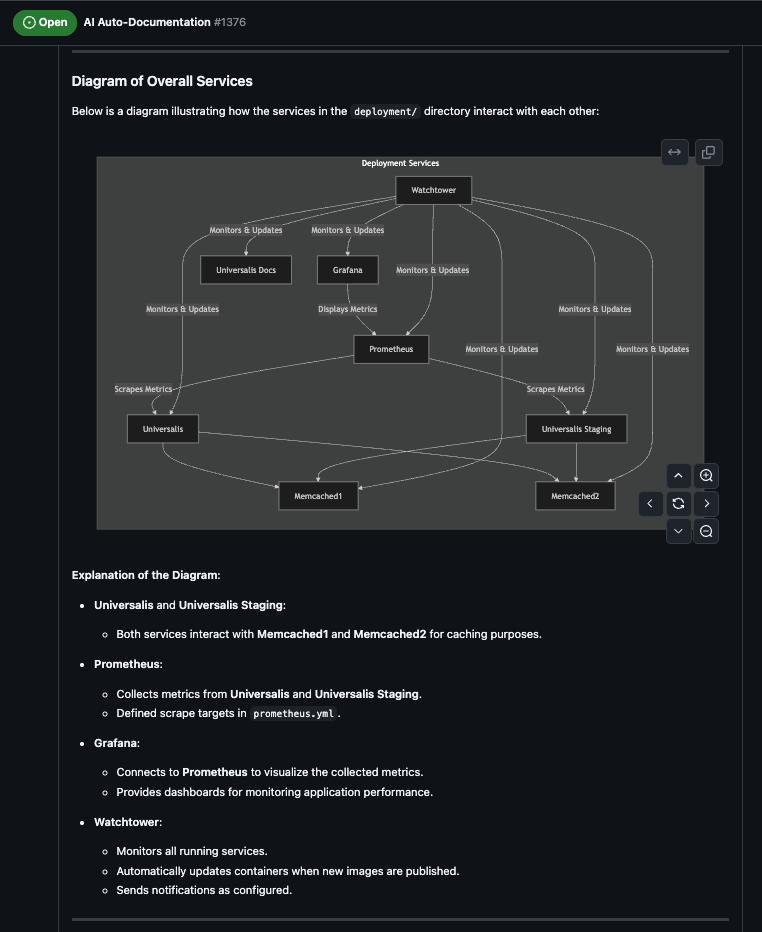
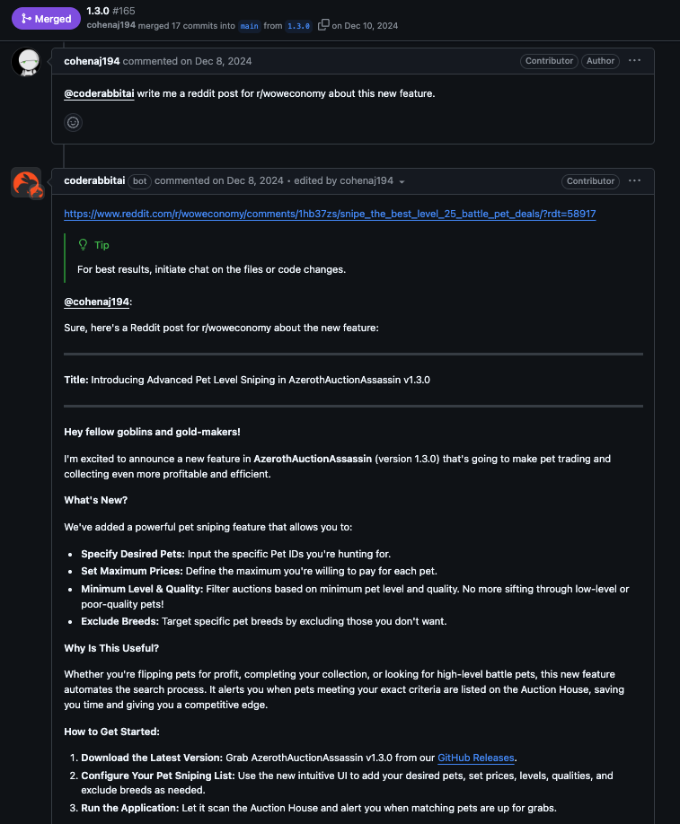

```mdx-code-block
import ProPlanNotice from '@site/src/components/ProPlanNotice.mdx';

<ProPlanNotice />
```

# Issue Chat

CodeRabbit provides an intelligent chat interface directly within GitHub and GitLab issues. This allows developers to have natural conversations about code, get answers to questions, create AI powered code searches, plan features, and gain deeper insights into their codebase - all without leaving their issue tracking workflow.

## Getting Started

To start a conversation with CodeRabbit in any issue:

1. Simply mention `@coderabbitai` (or your custom bot name if configured) in an issue comment
2. Ask your question or make your request in natural language
3. CodeRabbit will analyze the context and respond accordingly

:::note
Organizations can configure a custom bot name by creating their own bot user. The bot will respond to mentions of that custom name instead of `@coderabbitai`.
:::





## Core Capabilities

### Code Analysis

When chatting in issues, CodeRabbit has access to your repository and powerful tools that allow it to analyze and understand your codebase like a real developer. This includes:

- Full access to search and analyze the repository code
- Advanced static analysis capabilities
- Command line tools for code search and manipulation (e.g. grep, awk, sed, etc.)
- Complete git history and metadata information
- Access to past CodeRabbit learnings and insights

This allows CodeRabbit to:

- Search through code to find relevant examples
- Analyze code patterns and relationships
- Generate statistics and metrics
- Provide context-aware answers about the codebase
- Create AI powered code searches
- Use tribal knowledge from learnings to enhance responses





### Agentic Thought Chain

When [agentic thought chain](./agent_chat.md) is enabled, CodeRabbit will use an agentic thought chain to plan out a response using multiple commands in series to articulate a more advanced response.



All scripts run in the Agentic Thought Chain are run in a secure sandboxed execution environment.

### Feature Planning Support

Issue chat is particularly valuable during feature planning phases:

- **Code Impact Analysis**: Ask about which parts of the codebase might be affected by proposed changes
- **Pattern Discovery**: Find similar implementations or related code
- **Dependency Mapping**: Understand relationships between components
- **Technical Feasibility**: Get insights into potential challenges or approaches

Example conversation:



## Additional Use Cases

### Open Source Support

Issue chat, like all Pro CodeRabbit features, is free for open source projects. CodeRabbit acts as a powerful support tool for open source maintainers by:

- Answering common user questions with detailed, contextual responses
- Providing relevant code examples and implementation patterns
- Explaining error messages with debugging context and solutions
- Suggesting step-by-step debugging approaches with code snippets
- Helping triage and categorize issues
- Identifying potential duplicates and related issues
- Offering guidance on best practices and common pitfalls
- Reducing maintainer burden by handling routine support tasks

Example:



### Documentation Assistance

Use issue chat to generate high level descriptions of the code and services in your repositories. This can be used to create README documentation which can be used across platforms like [wikis](https://docs.github.com/en/communities/documenting-your-project-with-wikis), [Confluence](https://www.atlassian.com/software/confluence/guides), [Notion](https://www.notion.so/help/guides) and more:

- Generate high level documentation
- Create usage examples and mermaid diagrams
- Provide content to assist in updating README files
- Write tutorials

Example:



### Marketing Content Generation

CodeRabbit can assist with creating content on new features for social media posts, blogs, and more:

- Release announcements
- Blog post drafts
- Social media content
- Community updates

Example:



## Best Practices

1. **Be Specific**

   - Provide context in your questions
   - Mention specific files or features when relevant
   - Clarify your goals or requirements

2. **Iterative Refinement**

   - Start with broad questions
   - Follow up for more details
   - Ask for clarification when needed

3. **Collaborative Planning**

   - Include stakeholders in the conversation
   - Use issue chat to document decisions
   - Reference related issues or PRs

4. **Keep Questions Focused**
   - CodeRabbit works best with clear, specific questions
   - Link to specific files, directories or pull requests to help refine answers and provide better context
   - CodeRabbit does not generate API documentation, Swagger specs, or other technical documentation that requires high accuracy
   - Break down complex questions into smaller, more manageable ones
   - Use multiple messages to ask follow up questions if needed

## Related Resources

- [Agentic Chat](./agent_chat.md)
- [Issue Creation](./issue-creation.md)
- [Commands](./commands.md)
- [Tooling Guide](../tools/tools.md)
